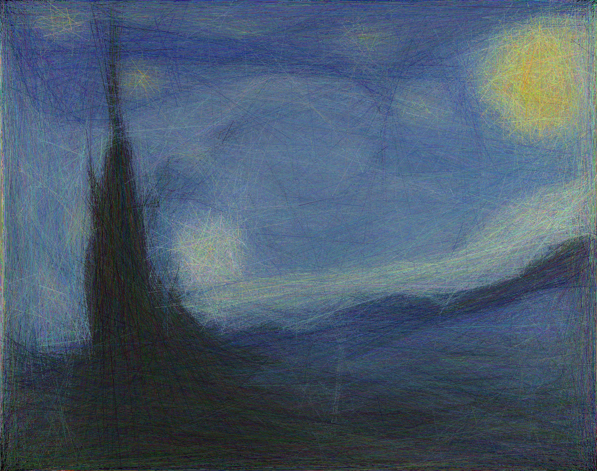
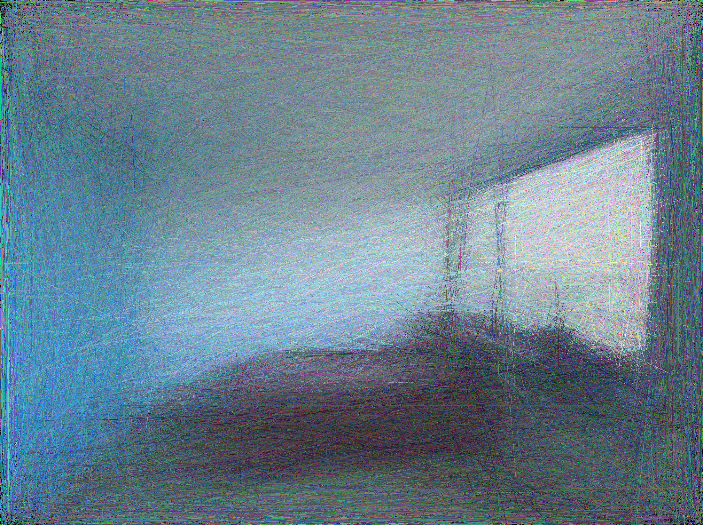
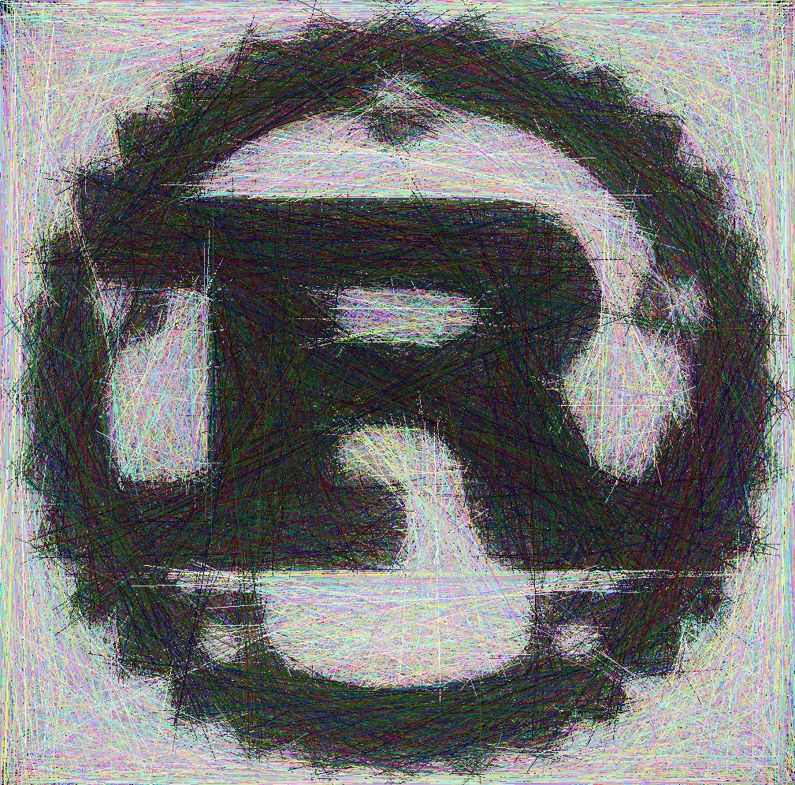

# linez

Quick & fun tool that approximates images using lines:

<p align="center">
  
</p>

<p align="center">
  
</p>

<p align="center">
  
</p>

## Usage

``` shell
$ git clone https://github.com/Patryk27/linez
$ cd linez
$ cargo run --release -- images/starry-night.jpg
# (press escape to close the app)
```

## Algorithm

1. Load image provided by user (aka the target image).
2. Create a black image (aka the approximated image).
3. Sample a line: randomize starting point, ending point, and color.
4. Check if drawing this line on the approximated image would reduce _the distance_ between the approximated image and the target image.
5. If so, draw the line; otherwise don't draw it.
6. Go to 3.

... where "distance between images" is e.g. mean squared error:

```
fn image_distance(img_a, img_b):
    assert img_a.size() == img_b.size()
    
    dist = 0.0
    
    for all pixels in img_a and img_b:
        dist += pixel_distance(pixel_a, pixel_b)
        
    return dist

fn pixel_distance(pixel_a, pixel_b):
    dist_r = (pixel_a.red - pixel_b.red) ^ 2
    dist_g = (pixel_a.green - pixel_b.green) ^ 2
    dist_b = (pixel_a.blue - pixel_b.blue) ^ 2
    
    return dist_r + dist_g + dist_b
```

## License

MIT License

Copyright (c) 2024 Patryk Wychowaniec
